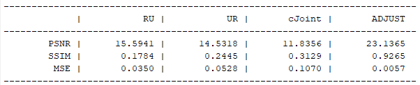
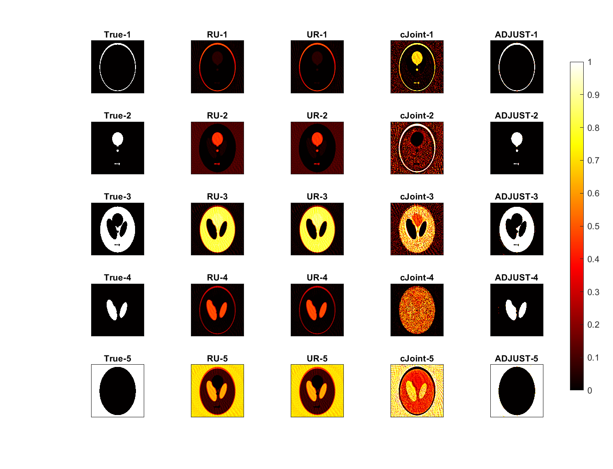

# ADJUST: A dictionary-based joint reconstruction and unmixing for spectral tomography


* **Documentation**: [link]

## Introduction

ADJUST is a MATLAB solver for large scale spectral 
tomographic inverse problems where a dictionary of spectral response
of various materials is available.  We also include following algorithms:

1. Unmixing-then-reconstruction (UR), Reconstruction-then-Unmixing (RU) and classic Joint reconstruction algorithm (cJoint) solves the following problem:  
   

2. ADJUST (dictonary-based method):  
   

The matrix W is a tomography operator of size m x n, 
Y are the tomographic measurements of size m x c, 
A contains the spatial information of materials (size: n x k), 
F contains the spectral information of materials (size: k x c),
T is a spectral dictionary of p materials, while R is dictionary coefficient matrix.
Here, m are the number of tomographic measurements, n is the size of image,
c are the spectral channels, and k are the number of materials.


## Requirements

To run the examples on MATLAB (r2019 and above recommended), please install the following packages:

1. ASTRA Toolbox: 
https://github.com/astra-toolbox/astra-toolbox
2. SPOT operator:
https://github.com/mpf/spot
3. MinConf package: 
https://www.cs.ubc.ca/~schmidtm/Software/minConf.html
4. 3D Shepp-Logan phantom package (for the 3D example only): 
https://www.mathworks.com/matlabcentral/fileexchange/9416-3d-shepp-logan-phantom


## Examples:

Seven examples are provided with the code. Before running any example, please run the startup.m script first. Each example uses a different phantom:
1. example_SheppLogan: 
The classic Shepp-Logan phantom with variable size
2. example_Disk: 
A custom-made disk example with variable size and number of disks
3. example_Thorax: 
The synthetic phantom mimics internal body structure in an abstract fashion (taken from the CONRAD software framework: https://git5.cs.fau.de/PyConrad/pyCONRAD)
4. example_SheppLogan_SparseAngle: 
The Shepp-Logan phantom with only 10 projection angles (adjustable)
5. example_SheppLogan_LimitedView: 
The Shepp-Logan phantom with a missing wedge of 60 degrees (adjustable)
6. example_MixedDisk: 
A custom-made disk example with variable size and number of disks, where the disks consists of multiple materials
7. example_SheppLogan3D: 
3D version of the Shepp-Logan phnatom with adjustable size

On each phantom we perform the four implemented algorithms (UR, RU, cJoint and ADJUST). The perfomance of these algorithms are captured by computing and presenting the MSE, PSNR, and the SSIM between the reconstructed material maps and the ground truth. Below are results for a numerical study on the Shepp-Logan phantom:

   
   
   


## Generation of spectral data

To reproduce the provided material spectra matrices (F and T), the scripts for generating these are provided in the python_spectral folder.
These scripts are written in Python (version 3.7 or higher). Apart from this, physdata, csv and scipy are necessary to run these scripts.


## References

The algorithms implemented in this MATLAB package are described in following paper:

```
@article{
  title={ADJUST: A Dictionary-Based Joint Reconstruction and Unmixing Method for Spectral Tomography},
  author={Zeegers, Math{\'e} T and Kadu, Ajinkya and van Leeuwen, Tristan and Batenburg, Kees Joost},
  journal={arXiv preprint arXiv:2112.11406},
  year={2021}
}
```
The preprint can be found [here](https://arxiv.org/pdf/2112.11406.pdf).


